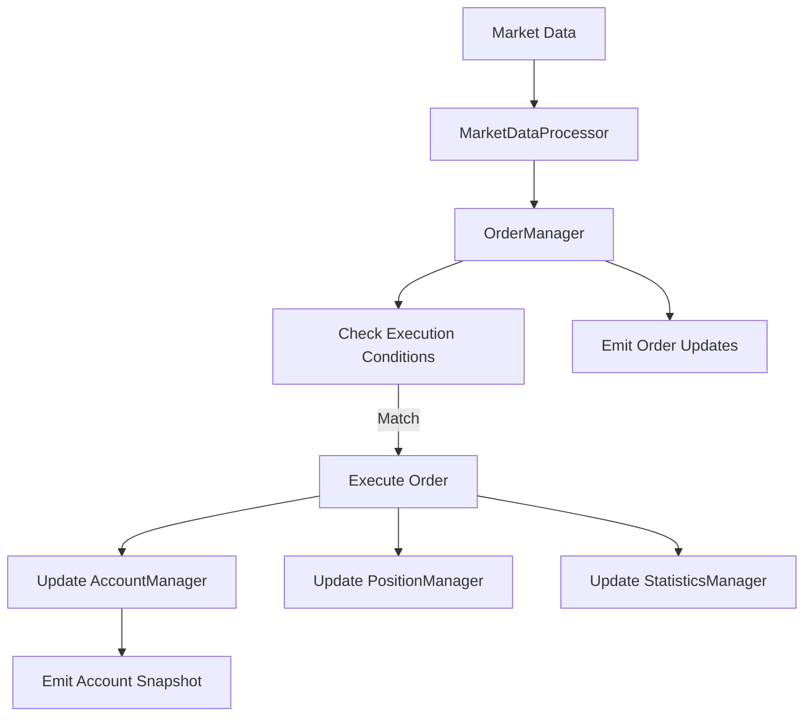

# Design Document

## Overview

BacktestMemoryAdapter是一个完全在内存中运行的ExchangeAdapter实现，用于交易策略的回测。它模拟真实交易所的行为，包括账户管理、订单簿、订单执行和统计分析，使开发者能够在历史数据上验证策略而无需连接真实交易所或支付交易费用。

该适配器的核心设计理念是：
- **完全内存操作**：所有数据存储在内存中，无需数据库
- **事件驱动**：通过回调机制与策略引擎通信
- **价格驱动执行**：根据市场价格自动匹配和执行限价单
- **统计导向**：实时计算关键回测指标

## Architecture

### 类结构

```typescript
BacktestMemoryAdapter implements ExchangeAdapter {
  // 核心组件
  - accountManager: AccountManager
  - orderManager: OrderManager
  - positionManager: PositionManager
  - statisticsManager: StatisticsManager
  - marketDataProcessor: MarketDataProcessor
  
  // 配置
  - config: BacktestConfig
  
  // 回调注册
  - accountCallback: AccountListener | null
  - orderCallback: OrderListener | null
  - tickerCallback: TickerListener | null
  - klineCallback: KlineListener | null
}
```

### 组件职责

1. **AccountManager**: 管理账户余额和资产
2. **OrderManager**: 管理订单生命周期和执行逻辑
3. **PositionManager**: 跟踪持仓和计算盈亏
4. **StatisticsManager**: 收集和计算回测统计指标
5. **MarketDataProcessor**: 处理市场数据并触发订单执行

## Components and Interfaces

### 1. BacktestConfig

配置接口定义回测参数：

```typescript
interface BacktestConfig {
  initialBalance: number;           // 初始资金
  feeRate: number;                   // 手续费率 (默认 0.0005 = 0.05%)
  symbol: string;                    // 交易对
  slippage?: number;                 // 滑点 (可选)
}
```

### 2. AccountManager

管理虚拟账户状态，使用`AsterAccountSnapshot`和`AsterAccountAsset`：

```typescript
class AccountManager {
  private totalWalletBalance: number;
  private availableBalance: number;
  private totalUnrealizedProfit: number;
  private assets: Map<string, AsterAccountAsset>;
  
  constructor(initialBalance: number, baseAsset: string = 'USDT')
  getSnapshot(positions: AsterAccountPosition[]): AsterAccountSnapshot
  updateBalance(amount: number): void
  reserveFunds(amount: number): boolean
  releaseFunds(amount: number): void
  updateUnrealizedProfit(profit: number): void
}
```

### 3. OrderManager

管理订单状态和执行：

```typescript
interface OrderRecord {
  order: AsterOrder;
  createTime: number;
  fillTime?: number;
  fillPrice?: number;
  fee?: number;
  status: 'PENDING' | 'FILLED' | 'CANCELLED';
}

class OrderManager {
  private pendingOrders: Map<string, OrderRecord>;
  private orderHistory: OrderRecord[];
  private feeRate: number;
  
  createOrder(params: CreateOrderParams): AsterOrder
  cancelOrder(orderId: string): void
  cancelAllOrders(symbol: string): void
  checkAndExecuteOrders(kline: OHLCV): OrderRecord[]
  getOpenOrders(): AsterOrder[]
  getOrderHistory(): OrderRecord[]
}
```


订单执行逻辑：
- **买单执行条件**: `Number(order.price) >= Number(kline.low)`
- **卖单执行条件**: `Number(order.price) <= Number(kline.high)`
- **执行价格**: 使用订单的限价作为成交价
- **手续费计算**: `fee = Number(order.price) * Number(order.origQty) * feeRate`
- **订单状态更新**: 将`status`从'NEW'更新为'FILLED'，设置`executedQty = origQty`

### 4. PositionManager

跟踪持仓状态，使用现有的`AsterAccountPosition`类型：

```typescript
class PositionManager {
  private positions: Map<string, AsterAccountPosition>;
  private realizedPnl: Map<string, number>;  // 跟踪已实现盈亏
  
  updatePosition(symbol: string, side: OrderSide, quantity: number, price: number, fee: number): void
  getPosition(symbol: string): AsterAccountPosition | null
  calculateUnrealizedPnl(symbol: string, currentPrice: number): number
  getPositions(): AsterAccountPosition[]
  getRealizedPnl(symbol: string): number
}
```

持仓更新逻辑：
- **买入**: 增加`positionAmt`，更新`entryPrice`
- **卖出**: 减少`positionAmt`，计算已实现盈亏
- **平均成本计算**: `newEntryPrice = (oldAmt * oldEntry + newAmt * newPrice) / (oldAmt + newAmt)`
- **已实现盈亏**: 当持仓减少时计算，存储在独立的Map中
- **未实现盈亏**: 更新`unrealizedProfit`字段，基于当前市场价格

### 5. StatisticsManager

计算回测统计指标：

```typescript
interface BacktestStatistics {
  // 基础指标
  totalTrades: number;
  winningTrades: number;
  losingTrades: number;
  winRate: number;
  
  // 盈亏指标
  totalPnl: number;
  totalReturn: number;              // 收益率
  realizedPnl: number;
  unrealizedPnl: number;
  
  // 风险指标
  maxDrawdown: number;              // 最大回撤金额
  maxDrawdownPct: number;           // 最大回撤百分比
  peakBalance: number;              // 历史最高余额
  
  // 交易质量
  bestTrade: TradeRecord | null;    // 最大盈利订单
  worstTrade: TradeRecord | null;   // 最大亏损订单
  avgWin: number;                   // 平均盈利
  avgLoss: number;                  // 平均亏损
  profitFactor: number;             // 盈亏比
  
  // 费用
  totalFees: number;
}

interface TradeRecord {
  orderId: string;
  side: OrderSide;
  price: number;
  quantity: number;
  pnl: number;
  fee: number;
  timestamp: number;
}

class StatisticsManager {
  private stats: BacktestStatistics;
  private trades: TradeRecord[];
  private balanceHistory: number[];
  private initialBalance: number;
  
  recordTrade(trade: TradeRecord): void
  updateBalance(currentBalance: number): void
  calculateMaxDrawdown(): void
  getStatistics(): BacktestStatistics
}
```

### 6. MarketDataProcessor

处理市场数据并触发订单执行，使用现有的`AsterTicker`和`AsterKline`：

```typescript
class MarketDataProcessor {
  private currentPrice: number;
  private lastTicker: AsterTicker | null;
  private lastKline: AsterKline | null;
  
  processTicker(ticker: AsterTicker): void
  processKline(kline: AsterKline): void
  getCurrentPrice(): number
  getLastTicker(): AsterTicker | null
}
```

## Data Models

### 内部数据结构

使用现有的类型，最小化新类型定义：

```typescript
// 使用现有类型
// - AsterAccountSnapshot: 账户快照
// - AsterAccountAsset: 资产余额
// - AsterAccountPosition: 持仓信息
// - AsterOrder: 订单信息
// - AsterTicker: 市场价格
// - AsterKline: K线数据

// 订单记录（扩展AsterOrder）
interface OrderRecord {
  order: AsterOrder;
  createTime: number;
  fillTime?: number;
  fillPrice?: number;
  fee?: number;
  status: 'PENDING' | 'FILLED' | 'CANCELLED';
  pnl?: number;          // 该订单的盈亏（如果是平仓单）
}
```

### 数据流



## Error Handling

### 错误类型

1. **余额不足错误**: 创建订单时余额不足
2. **无效订单参数**: 价格、数量为负或零
3. **订单不存在**: 取消不存在的订单
4. **市场数据缺失**: 没有价格数据时尝试执行订单

### 错误处理策略

```typescript
class BacktestError extends Error {
  constructor(public code: string, message: string) {
    super(message);
  }
}

// 错误码
enum ErrorCode {
  INSUFFICIENT_BALANCE = 'INSUFFICIENT_BALANCE',
  INVALID_ORDER_PARAMS = 'INVALID_ORDER_PARAMS',
  ORDER_NOT_FOUND = 'ORDER_NOT_FOUND',
  NO_MARKET_DATA = 'NO_MARKET_DATA',
}
```

处理原则：
- **余额不足**: 拒绝订单创建，返回错误
- **无效参数**: 抛出异常，阻止订单创建
- **订单不存在**: 静默处理，记录警告
- **市场数据缺失**: 跳过执行检查，等待下一次更新

## Testing Strategy

### 单元测试

测试各个组件的独立功能：

1. **AccountManager测试**
   - 初始化余额
   - 资金预留和释放
   - 余额更新

2. **OrderManager测试**
   - 订单创建
   - 订单执行逻辑（买单/卖单）
   - 订单取消
   - 手续费计算

3. **PositionManager测试**
   - 持仓更新（买入/卖出）
   - 平均成本计算
   - 未实现盈亏计算
   - 已实现盈亏计算

4. **StatisticsManager测试**
   - 交易记录
   - 最大回撤计算
   - 胜率计算
   - 盈亏比计算

### 集成测试

测试完整的回测流程：

1. **基础回测流程**
   - 初始化适配器
   - 创建订单
   - 处理市场数据
   - 订单自动执行
   - 统计指标计算

2. **网格策略回测**
   - 使用真实历史数据
   - 验证订单执行时机
   - 验证持仓变化
   - 验证最终统计结果

3. **边界条件测试**
   - 余额耗尽场景
   - 大量订单场景
   - 价格剧烈波动场景

### 测试数据

使用现有的测试数据：
- `tests/data/BTC-1m.csv`: 比特币1分钟K线数据
- 模拟不同市场条件（上涨、下跌、震荡）

## Implementation Notes

### 性能考虑

1. **订单匹配优化**: 使用Map存储待执行订单，O(1)查找
2. **统计计算**: 增量更新而非每次重新计算
3. **内存管理**: 限制历史记录数量，避免内存溢出

### 扩展性

设计支持未来扩展：
- **多交易对支持**: 当前设计已支持多symbol
- **更复杂的订单类型**: 可扩展支持止损单、市价单等
- **滑点模拟**: 预留slippage配置
- **更多统计指标**: StatisticsManager易于扩展

### 与现有代码集成

- 完全实现`ExchangeAdapter`接口
- 可直接替换`StubAdapter`用于回测
- 与`GridEngine`无缝集成
- 支持现有的测试框架（Vitest）
