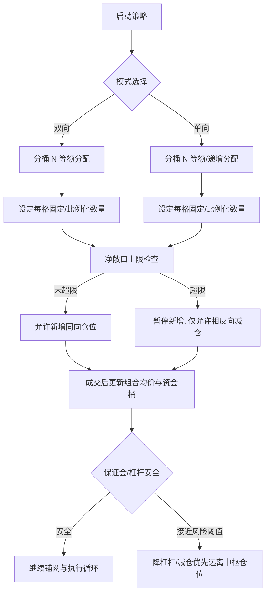
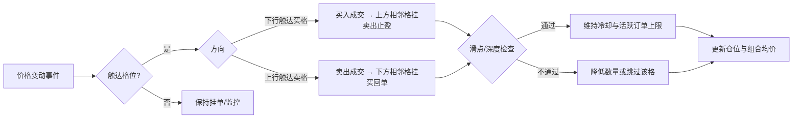
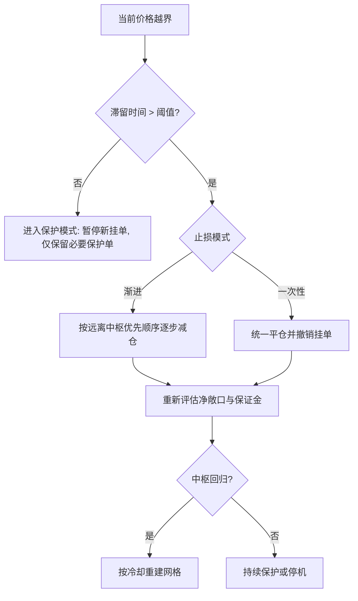
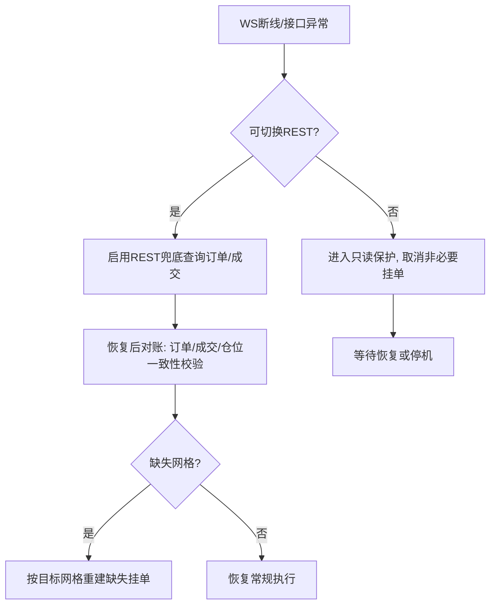
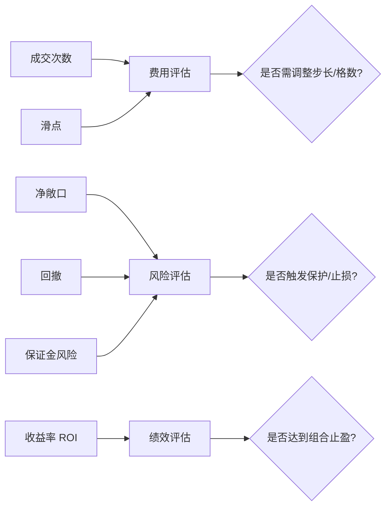

# 网格交易策略执行流程（实操版）

目标
- 提供可执行的操作流程，覆盖网格区间规则、触发条件、订单类型、仓位与资金、止盈止损、风控与异常处理。
- 适配双向/单向网格、静态/动态区间，兼容做市型限价执行。

适用范围
- 适用于流动性良好、手续费可控的现货/永续合约市场。默认限价被动执行，必要时市价快速退出。

执行顺序总览
1) 启动前检查 → 2) 区间与步长设定 → 3) 铺网挂单 → 4) 成交响应与再挂单 → 5) 仓位与资金管理 → 6) 止盈止损执行 → 7) 风控巡检 → 8) 异常处理与恢复 → 9) 监控与复盘

---

## 1. 启动前检查（Go/No-Go）
- 品种与市场：确认标的的24h成交量、盘口深度、做市稳定性达标。
- 保证金与杠杆：设置杠杆上限与预期强平安全距离；预留保证金缓冲≥20%。
- 费用与返佣：评估费率对网格密度的影响，必要时放大步长或降低格数。
- 数据源健康：指数价/标记价与现价偏差在阈值内；备用数据源可用。
- 事件窗口：重大公告或高波动时段暂停启动或降密度运行。

## 2. 区间与步长设定
- 基准价：以近N小时的加权均价或EMA作为中枢。
- 上下边界：参考历史波动与ATR，设置上下限；动态模式下定义移动阈值与冷却时间。
- 步长（格距）：固定点值或百分比；建议 0.5—1.0 ATR。
- 格子数量：在资金、费率与风控约束下设定，兼顾密度与管理成本。
- 方向模式：
  - 双向网格：上下对称买卖。
  - 单向网格：仅买或仅卖，叠加趋势反转保护。
- 活跃约束与冷却：最大活跃订单数、同价位冷却秒数、每日交易次数上限。

## 3. 铺网挂单
- 启动条件：当前价格位于区间内、盘口深度达标。
- 布置原则：在每个格位价格上预先挂买/卖限价单（post-only优先），数量与方向一致。
- 边界保护：价格临近或越界时暂停新挂单，进入保护模式。

## 4. 触发与成交响应
- 触发条件：
  - 买入触发：价格下行触碰/穿越买入格。
  - 卖出触发：价格上行触碰/穿越卖出格。
- 成交后再挂单：
  - 买入成交 → 上方相邻格布置对应卖出止盈单。
  - 卖出成交 → 下方相邻格布置对应买回单。
- 重试与冷却：
  - post-only拒绝或失败 → 按重试间隔与次数重试。
  - 同价位触发遵守冷却与最大活跃订单上限。
- 深度与滑点控制：滑点/深度不佳时降低数量或跳过该格。

## 5. 仓位与资金管理
- 分桶法：总资金分为N个桶对齐N个格；每格固定或比例化数量。
- 净敞口上限：设置多/空净敞口上限；超限暂停新增同向仓位。
- 均价与成本：实时计算组合加权成本；用于组合止盈决策。
- 多空平衡：双向保持对称；单向需额外反向保护（趋势反转快速减仓）。
- 杠杆动态：随着保证金占用与强平价变化，降低新挂单或减杠杆。

## 6. 止盈止损机制
- 单格止盈：每次买入对应上方固定利润距离的卖出目标。
- 组合止盈：组合达到目标收益率（如1%—2%）时部分或全部止盈。
- 边界止损：价格越界并滞留超过阈值，统一止损或渐进减仓。
- 时间止损：持仓超最大时长未达收益 → 减仓或平仓。
- 强平保护：保证金风险抬升时优先平掉远离中枢且未盈利的仓位。

## 7. 风控巡检
- 最大亏损与回撤：设定日内/策略级阈值，触发即暂停并进入保护。
- 成交频率与活跃挂单：限制单位时间的成交次数与挂单量。
- 盘口质量：点差扩大/深度下降 → 加大步长、减少挂单或暂停。
- 波动事件保护：重大消息窗口内放宽止盈或暂停新网。

## 8. 异常处理与恢复
- 订单被拒/部分成交：重试post-only或微调价格；部分成交补单或撤销，同步仓位与目标单。
- 通讯异常：WS断线切REST兜底；恢复后对账订单与成交，重建缺失网格。
- 交易所限制：进入保护模式，取消非必要挂单，恢复后再铺网。
- 数据源异常：指数/标记价异常偏离时启用备用源或停机。
- 一致性校验：周期性校验“仓位—平仓单—目标网格”，发现偏差即重建或人工干预。
- 优雅关闭：达到目标或触发阈值时，逐步撤单与净化仓位，保留必要保护单后退出。

## 9. 监控与复盘
- 指标：成交次数、滑点、费用、净敞口、收益率、回撤。
- 告警：阈值触发邮件/IM告警。
- 日志：记录触发、成交、撤单、重试与风控动作，供参数迭代。
- 参数迭代：AB对比步长、格数、分配比例与止盈止损参数调整前后绩效。

---

### 操作Checklist（精简版）
- 启动前：流动性/费用/保证金/数据源健康检查通过。
- 区间/步长：设定上下边界、步长、格数、方向模式与冷却。
- 铺网：post-only限价铺满各格，边界保护启用。
- 执行循环：成交→相邻格再挂；重试与冷却生效。
- 仓位与资金：净敞口不上限；分桶稳定；组合均价跟踪。
- 止盈止损：单格与组合止盈；边界/时间止损与强平保护。
- 风控：回撤/频率/盘口质量/事件保护持续巡检。
- 异常：通讯/数据/交易所问题的兜底与一致性修复。
- 关闭：日内目标或阈值触发后优雅退出。

---

## 图例附录

### A. 仓位管理逻辑（Flowchart）

### B. 盈利预测示例（静态网格简化模型）
- 假设：
  - 步长 d = 0.7%（相对中枢），每格买入后上方一格卖出止盈；
  - 每格名义金额 Q；maker费率 fm = 0.02%，taker费率 ft = 0.06%（post-only优先，默认以maker计）。
- 单轮格收益近似：
  - 毛收益 ≈ d × 中枢价格 × Q
  - 费用 ≈ 2 × fm × 中枢价格 × Q
  - 净收益 ≈ (d - 2×fm) × 中枢价格 × Q
- 例：中枢 100，d=0.7%，fm=0.02%，Q=1000 名义
  - 毛收益 ≈ 0.007 × 100 × 1000 = 700
  - 费用 ≈ 2 × 0.0002 × 100 × 1000 = 40
  - 净收益 ≈ 660
- 敏感性提示：
  - 步长越小 → 成交频率提升但单位收益下降，受费率影响更敏感；
  - 费率越高 → 建议加大步长或降低格密度；
  - 动态区间滚动时，中枢移动会影响有效格利用率与组合均价。

### C. 触发与再挂单决策树

### D. 边界越界与止损决策树

### E. 异常与兜底处理决策树

### F. 监控指标与告警关系图（示意）

### G. 按真实数据重绘图表（操作说明）
- 数据准备
  - 参数模板：先在 docs/strategy/grid-chart-params.md 填写你的交易所、标的与参数。
  - 数据来源：选择实盘成交记录或回测结果；建议包含时间戳、方向、成交价、数量、费用、逐笔PnL或区间累计PnL。
  - 清洗规范：剔除异常记录与数据源跳变；对不同费用与滑点做统一口径处理。
- 直方图重绘（盈亏分布）
  - 选择样本时间窗与分箱数（bins）；按参数模板中的设定分箱。
  - 将PnL值映射到分箱区间，统计频数；正负分箱分别着色。
  - 输出目标：SVG文件（建议路径 docs/strategy/charts/pnl-histogram.svg），并在文档中引用。
- 雷达图重绘（参数敏感性）
  - 选择维度（建议6项：步长、费率、滑点、格数、净敞口、ROI目标）。
  - 对每一维进行有界变动测试（在合理区间内变化），记录绩效敏感性（如ROI或夏普的变化幅度）。
  - 对敏感性数值归一化至统一量纲（如0—1或0—100），绘制雷达图轮廓。
  - 输出目标：SVG文件（建议路径 docs/strategy/charts/radar-sensitivity.svg），并在文档中引用。
- 一致性与校验
  - 与策略日志对账：触发、成交、撤单、重试与风控动作与数据源一致。
  - 指标复核：滑点、费用、净敞口与风险指标与监控面板一致。
- 交付物清单
  - 已填写参数模板：docs/strategy/grid-chart-params.md
  - 实盘/回测数据文件：按项目约定路径保存（例如 data/backtest/*.csv）
  - 两张SVG图表：docs/strategy/charts/radar-sensitivity.svg 与 docs/strategy/charts/pnl-histogram.svg
  - 文档引用已更新：在“图例附录”中挂载预览链接
- 建议
  - 先用小样本验证分箱与敏感性维度；通过后再扩展至完整窗口。
  - 对不同市场阶段（平稳/高波动）分别重绘，便于比较。

### H. CSV字段说明速查
- timestamp：ISO8601时间（建议UTC）
- side：buy | sell
- price：成交价
- qty：成交数量（基础币或合约张数）
- fee：费用（报价币绝对值）
- slippage_bps：相对盘口/中价的滑点（bps）
- pnl：该笔或该循环的已实现PnL（报价币），需统一口径
- order_type：limit | market | ioc | fok
- grid_level：执行时对应的网格层级索引（整数）
- portfolio_avg_cost：成交后组合加权成本（每单位报价）
- exposure_after：成交后净敞口绝对值（报价或张数）
- spread_bps：当时最优盘口点差（bps）
- depth_top_quote：当时最优盘口深度（报价币）
- maker_taker：maker | taker（post-only成交应为maker）
- roi_pct：组合ROI百分比（可按采样记录）
- drawdown_pct：组合回撤百分比（可选）
- range_mid / range_lower_pct / range_upper_pct：区间中枢与上下边界（相对中枢的百分比）
- step_type / step_value：步长类型与数值（% / 点值 / ATR比例）
- grids：总格数
- post_only：true | false
- retry_count：post-only重试次数
- cooldown_sec：同价位冷却秒数
- 可选扩展：bucket_id、funding_rate、mark_price、index_price、liquidation_buffer_pct、risk_score、event_type

注：
- 字段口径需与监控面板与策略日志一致；如发生变更，请在数据模板与说明同时更新。
- 实际数据文件可以在 docs/strategy/grid-chart-data-template.csv 基础上扩展字段。

注：
- Mermaid 图在多数文档渲染器中可视化；如需PNG或SVG，可在CI中使用 mermaid-cli 生成图像并归档。
- 盈利预测为静态近似，实际收益受成交路径、滑点、费用和中枢滚动影响，应结合回测与实盘数据校准。